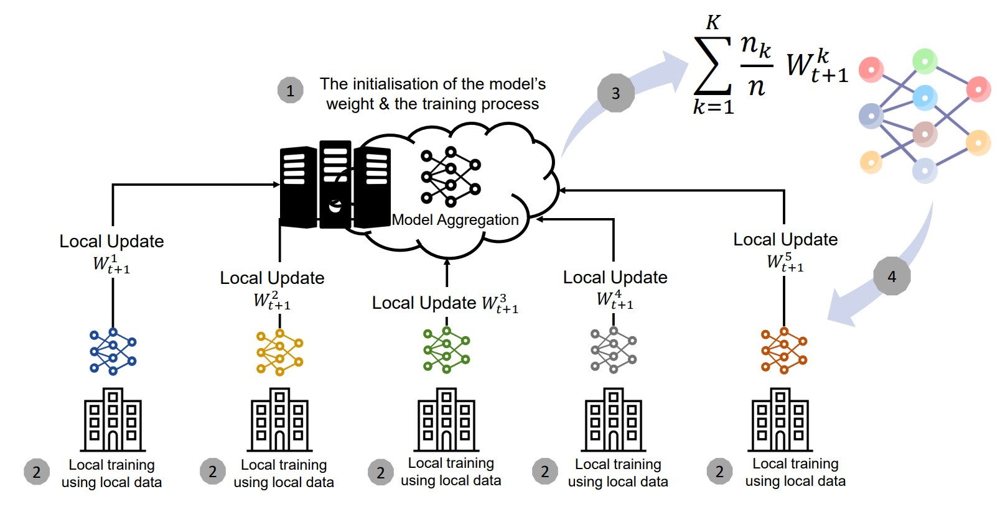
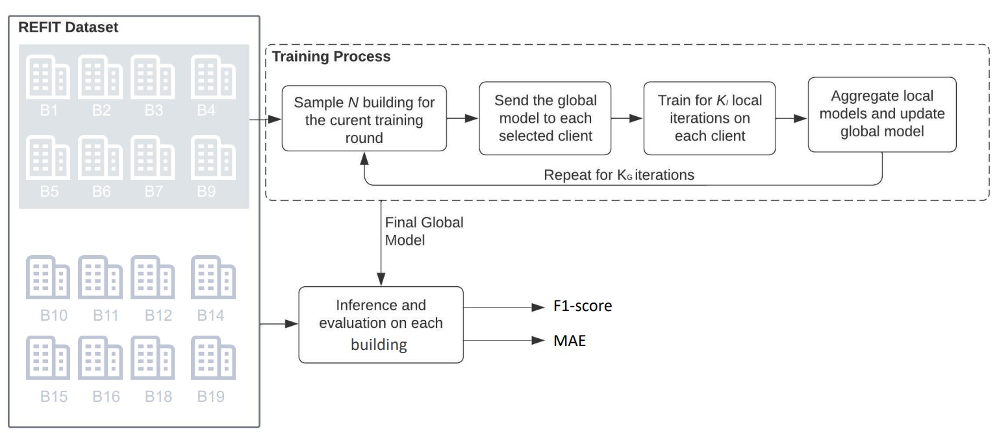

# Federated NILMtk 



The current repository suggests a federated NILM disaggregator allowing to simulate 
distributed training to find a balance between high sampling rate required by
deep models and the privacy of the consumers since no data is exchanged and the
models are trained locally  and aggregated at a central node.

## Working flow

The suggested code allows the simulation of federated training setups. 
The suggested extension is fully compatible with the new API of 
NILMtk. It allows specifying the different buildings contributing 
to the training as well as the number of randomly 
selected clients in each training round. 
The figure below illustrates the different steps followed by 
the suggested code. Furthermore, the FedAvg algorithm is 
used for aggregating the locally trained models. Thus, 
the suggested code assumes that the same data is available for 
different clients.
The disaggregator is compatible with all seq2point models implemented 
in [Deep-NILMtk](https://github.com/BHafsa/deep-nilmtk-v1), where 
the model type can be specified as a hyperparameter for the FL framework. 



## How to run ?

```
docker build -t experiment_setup .
docker run --gpus 'all' --name exp_exec experiment_setup
docker cp exp_exec:/home/guestuser/model_evaluation ./results
```

## Citation

```
Bousbiat, H.; Himeur, Y.; Varlamis, I.; Bensaali, F.; Amira, A.; Neural Load Disaggregation:Meta-analysis, Federated Learning and Beyond. Energies 2023
```

## Author

**Hafsa Bousbiat**, email: [hafsa.bousbiat@gmail.com](hafsa.bousbiat@gmail.com)

## Copyright and license
Code released under the [MIT Licence](https://github.com/BHafsa/DNN-NILM-experiment/blob/main/LICENSE).
****
